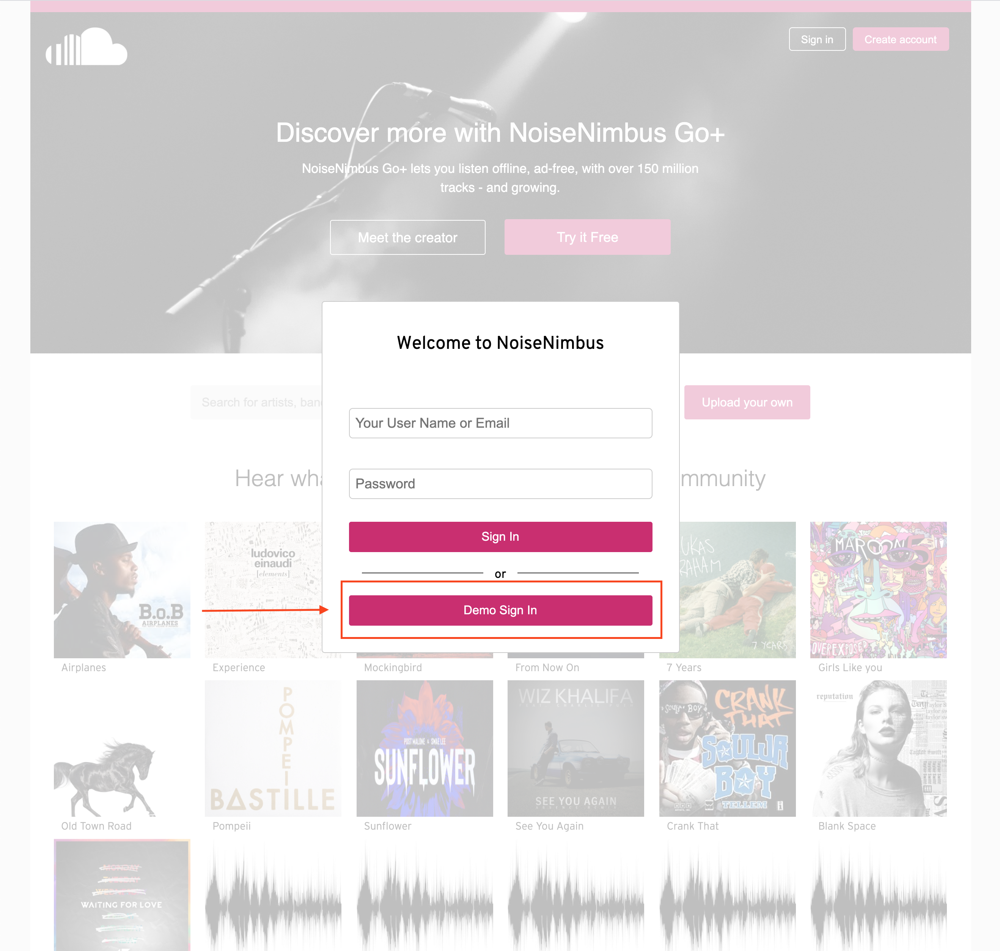
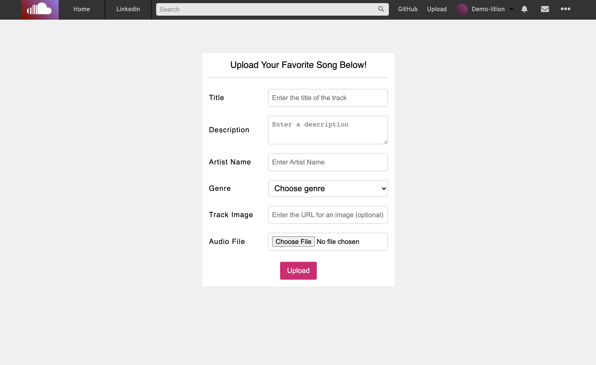
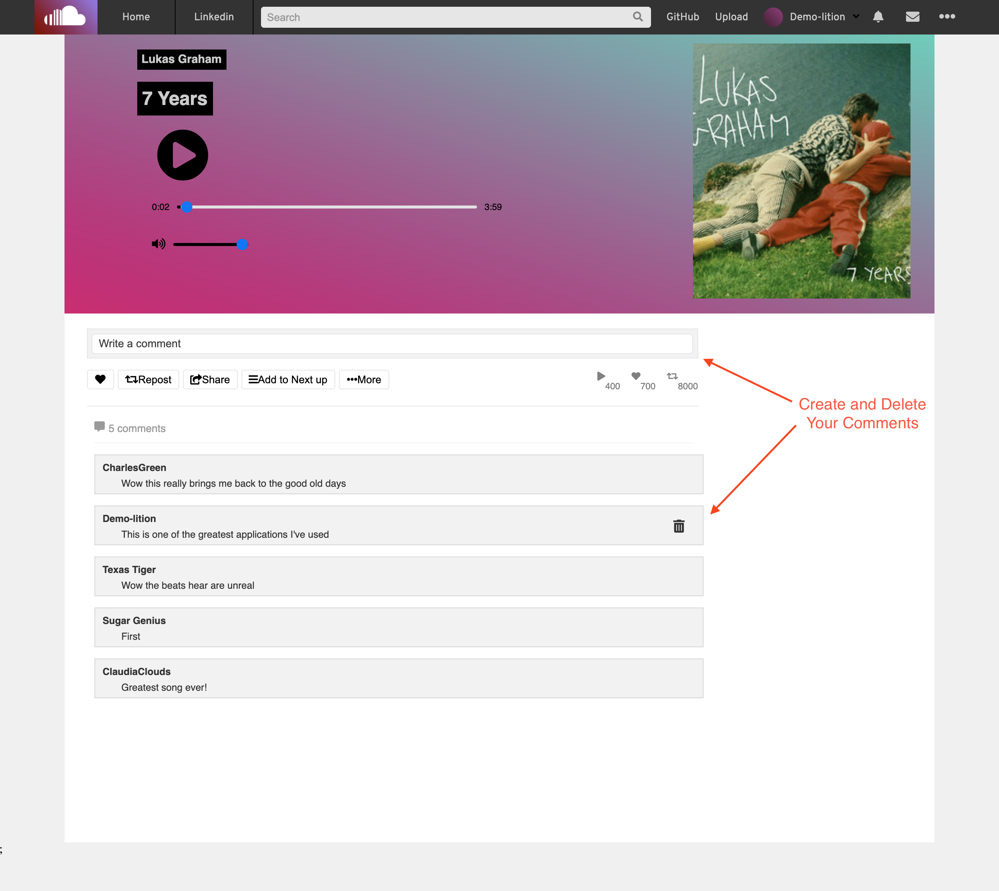

<!-- PROJECT SHIELDS -->
<!--
*** I'm using markdown "reference style" links for readability.
*** Reference links are enclosed in brackets [ ] instead of parentheses ( ).
*** See the bottom of this document for the declaration of the reference variables
*** for contributors-url, forks-url, etc. This is an optional, concise syntax you may use.
*** https://www.markdownguide.org/basic-syntax/#reference-style-links
-->


<!-- PROJECT LOGO -->
<br />
<p align="center">
  <a href="https://noisenimbus.herokuapp.com/">
    
  </a>

  <h3 align="center">NoiseNimbus</h3>

  <p align="center">
NoiseNimbus, a SoundCloud clone, is a music sharing platform where anyone, from up-and-coming artists to professionals, can upload their music for users to discover.    <br />
    <a href="https://github.com/husseineid-mocha/noise-nimbus/wiki"><strong>Explore the docs »</strong></a>
    <br />
    <br />
    <a href="https://noisenimbus.herokuapp.com/">View Site</a>
    ·
    <a href="https://github.com/husseineid-mocha/noise-nimbus/issues">Report Bug</a>
    ·
    <a href="https://github.com/husseineid-mocha/noise-nimbus/issues">Request Feature</a>
  </p>
</p>


<!-- TABLE OF CONTENTS -->
<details open="open">
  <summary><h2 style="display: inline-block">Table of Contents</h2></summary>
  <ol>
    <li>
      <a href="#overall-structure">Overall Structure</a>
      <ul>
        <li><a href="#built-with">Built With</a></li>
      </ul>
    </li>
    <li>
      <a href="#getting-started">Getting Started</a>
      <ul>
        <li><a href="#prerequisites">Prerequisites</a></li>
        <li><a href="#installation">Installation</a></li>
      </ul>
    </li>
    <li><a href="#usage">Usage</a></li>
    <li><a href="#roadmap">Roadmap</a></li>
    <li><a href="#contributing">Contributing</a></li>
    <li><a href="#license">License</a></li>
    <li><a href="#contact">Contact</a></li>
    <li><a href="#acknowledgements">Acknowledgements</a></li>
  </ol>
</details>


<!-- ABOUT THE PROJECT -->

## Overall Structure

### Back End
The app was built using a combination of express and sequelize with a PostgreSQL database. The backend structure is RESTful API. Model associations are used to minimize database queries to the backend, assuring speed and reliability.

### Front End
The frontend was built with React/Redux. By utilizing React and Redux state, NoiseNimbus is a seamless, single-page aplication. All page interactions are controlled by the React/Redux state.
### Built With

* [React](https://reactjs.org/)
* [Redux](https://redux.js.org/)
* [JavaScript](https://www.javascript.com/)
* [Sequelize](https://sequelize.org/)
* [PostgreSQL](https://www.postgresql.org/docs/current/)
* [SocketIO](https://socket.io/docs/v4)
* [CSS](http://www.css3.info/)

<!-- GETTING STARTED -->
## Getting Started

To get a local copy up and running follow these simple steps.

### Installation
To fork this project simply follow these steps!

1. Clone this repository.

    ```
    git clone https://github.com/husseineid-mocha/noise-nimbus.git
    ```

2. Install dependencies
    ```
    // backend
    npm install
    ```

3. Create a `.env` file in the backend folder using the provided `.env.example` file.

4. Create a `postgresql` user that matches the information in your `.env` file.
    ```
    // In the psql terminal
    CREATE USER user-from-env-file WITH PASSWORD 'password-from-env-file' CREATEDB
    ```
5. Create a `postgresql` development database
    ```
    // backend
    npx dotenv sequelize db:init
    ```
6. Migrate and seed the database
    ```
    // backend
    npx dotenv sequelize db:migrate
    npx dotenv sequelize db:seed:all
    ```
7. Start the backend
    ```
    npm start
    ```
8. Install dependencies in the frontend
    ```
    // frontend
    npm install
    ```
9. Start the frontend
    ```
    npm start
    ```


<!-- USAGE EXAMPLES -->
## Usage
### An easy-to-use login with a pre-configured Demo User

### Listen to music in the application or uploaded music using the NoiseNimbus music player

### Upload your own songs for users to enjoy

### Create and manage comments on your favorite songs


<!-- ROADMAP -->
## Roadmap

See the [Project Wiki](https://github.com/husseineid-mocha/noise-nimbus/wiki) for more details about NoiseNimbus.

<!-- CONTRIBUTING -->
## Contributing

Contributions are what make the open source community such an amazing place to be learn, inspire, and create. Any contributions you make are **greatly appreciated**.

1. Fork the Project
2. Create your Feature Branch (`git checkout -b feature/AmazingFeature`)
3. Commit your Changes (`git commit -m 'Add some AmazingFeature'`)
4. Push to the Branch (`git push origin feature/AmazingFeature`)
5. Open a Pull Request


<!-- CONTACT -->
## Contact 

* Hussein Eid - [LinkedIn](https://www.linkedin.com/in/hussein-eid/) - [GitHub](https://github.com/husseineid-mocha)


Project Link: [https://github.com/husseineid-mocha/noise-nimbus/](https://github.com/husseineid-mocha/noise-nimbus/)
